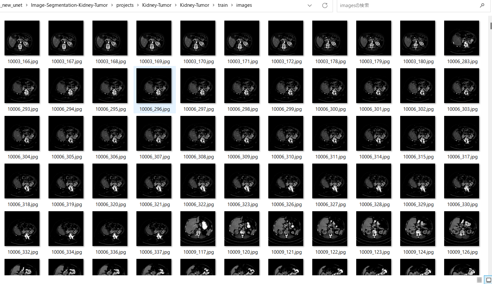
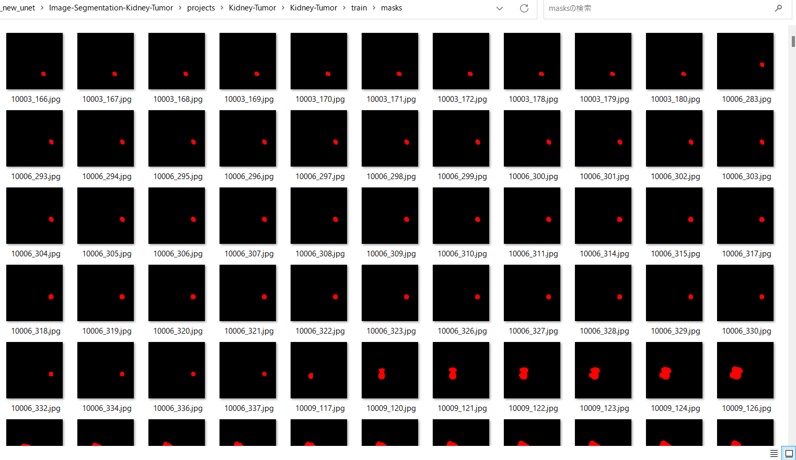
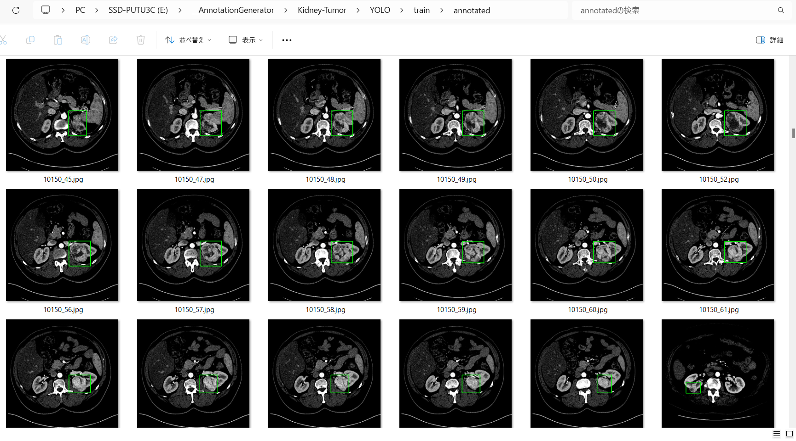

<h2>Kidney-Tumor-Image-Dataset (2024/01/21)</h2>
This is a Kidney-Tumor (kits19) dataset for Image Segmentation and Object Detection.   
Please see aslo our first experiment <a href="https://github.com/sarah-antillia/Image-Segmentation-Kidney-Tumor">
Image-Segmentation-Kidney-Tumor
</a> 

<h3>1. Dataset Citatioin</h3>

The image dataset used here has been taken from the following web site. 
We appreciate their contributions. 

<b>The official [2019 KiTS Challenge]</b>
<pre>
https://kits19.grand-challenge.org
</pre>
 
<b>The official 2019 KiTS Challenge repository.</b>
<pre>
https://github.com/neheller/kits19
</pre>

Please see also: <a href="https://kits-challenge.org/kits23/">[KiTS23 Homepage]</a> 
 

<a href="https://kits19.grand-challenge.org/data/"><b>Challenge Data</b></a>
 
 
<b>License: </b>
<pre>
The following applies to all content in this repository EXCEPT that within 
the data/ subdirectory.

MIT License

Copyright (c) 2019 Nicholas Heller

Permission is hereby granted, free of charge, to any person obtaining a copy
of this software and associated documentation files (the "Software"), to deal
in the Software without restriction, including without limitation the rights
to use, copy, modify, merge, publish, distribute, sublicense, and/or sell
copies of the Software, and to permit persons to whom the Software is
furnished to do so, subject to the following conditions:

The above copyright notice and this permission notice shall be included in all
copies or substantial portions of the Software.

THE SOFTWARE IS PROVIDED "AS IS", WITHOUT WARRANTY OF ANY KIND, EXPRESS OR
IMPLIED, INCLUDING BUT NOT LIMITED TO THE WARRANTIES OF MERCHANTABILITY,
FITNESS FOR A PARTICULAR PURPOSE AND NONINFRINGEMENT. IN NO EVENT SHALL THE
AUTHORS OR COPYRIGHT HOLDERS BE LIABLE FOR ANY CLAIM, DAMAGES OR OTHER
LIABILITY, WHETHER IN AN ACTION OF CONTRACT, TORT OR OTHERWISE, ARISING FROM,
OUT OF OR IN CONNECTION WITH THE SOFTWARE OR THE USE OR OTHER DEALINGS IN THE
SOFTWARE.
</pre>

<h3>
2. Download master dataset
</h3>
  Please download the original image and mask dataset <b>kits19</b> by running the following commands. 
<pre>
>git clone https://github.com/neheller/kits19
>cd kits19
>pip install -r requirements.txt
>python -m starter_code.get_imaging
</pre>

The dataset <b>kits19</b> has the following folder structure. 
<pre>
./kits19
├─data
│  ├─case_00000
│  ├─case_00001
│  ├─case_00002
│  ├─case_00003
│  ├─case_00004
...
│  ├─case_00298
│  └─case_00299
└─starter_code
    
</pre>
Each case_* folder contains two types of nii.gz files, which include images and segmentations data.  
<pre>
imaging.nii.gz
segmentation.nii.gz
</pre>

<h3>
3. Create ImageMask Dataset
</h3>
<h3>
3.1 Create base dataset
</h3>
By using Python script <a href="./generator/create_base_dataset.py">create_base_dataset.py</a>,
 we have created <b>Kits19-base</b> jpg image dataset from the *.nii.gz files in data/case_* folders. 

<pre>
./Kits19-base
├─images
└─masks
</pre>

<h3>
3.2 Create augmented image and mask dataset
</h3>
By using Python script <a href="./generator/ImageMaskDatasetGenerator.py">ImageMaskDatasetGenerator.py</a>,
 we have created <b>Kits19-master</b> dataset from <b>Kits19-base</b> dataset. 
The script performs the following image processings. 
<pre>
1 Select mask files having an adequately large bounding box around each segmentated region.
2 Select image files corresponding to the selected mask files. 
3 Create flipped, mirrored and shrinked mask and image files from the selected masks and images.
</pre>

The created <b>Kits19-master</b> dataset has the following folder structure. 
<pre>
./Kits19-master
├─images
└─masks
</pre>

<h3>
3.4 Split master to test, train and valid 
</h3>
By using Python script <a href="./generator/split_master.py">split_master.py</a>,
 we have finally created <b>Kidney-Tumor</b> dataset from the Kidney-Tumor-master. 
<pre>
./Kidney-Tumor
├─test
│  ├─images
│  └─masks
├─train
│  ├─images
│  └─masks
└─valid
    ├─images
    └─masks
</pre>
<b>train/images samples:</b> 

 
<b>train/masks samples:</b> 

 

<h3>
4.Generate Annotation file
</h3>
<h3>
4.1 Generate YOLO Annotation
</h3>
To generate YOLO Anntotation files from the Kidney-Tumor datasets, 
please run Python script <a href="./YOLOAnnotationGenerator.py">YOLOAnnotationGenerator.py</a>. 
<pre>
python YOLOAnnotationGenerator.py
</pre>

This command generates the following YOLO folders, which contains <b>test</b>, <b>train</b> and <b>valid</b> 
<pre>
./YOLO
├─test
│  └─annotated
├─train
│  └─annotated
└─valid
    └─annotated
</pre>
For example, train folder contains a lot of jpg image files, yolo annotation text files, and annotated folder,
 
<pre>
train
├─annotated
├─10003_166.jpg
├─10003_166.txt
├─10003_167.jpg
├─10003_167.txt
├─...
...

</pre>
Annotated folder contains jpg image files with bounding boxes as shown below. 
 
 

<h3>
4.2 Generate TFRecord train and valid dataset
</h3>
By using <a href="https://github.com/sarah-antillia/AnnotationConverters">AnnotationConverter</a>,
we have generated TFRecord dataset from train and valid dataset in YOLO annotation. 
<pre>
TFRecord
├─train
└─valid
</pre>

<h3>
4.3 Generate COCO test dataset
</h3>
By using <a href="https://github.com/sarah-antillia/AnnotationConverters">AnnotationConverter</a>,
we have generated COCO dataset from <b>test</b> dataset in YOLO annotation. 
<pre>
COCO
└─test
</pre>

<h3>
5. Kidney-Tumor Dataset for EfficientDet
</h3>
We have finally created the following <b>Kidney-Tumor-EfficientDet-Dataset</b> for 
<a href="https://github.com/google/automl/tree/master/efficientdet">efficientdet</a> object detection from TFRecord(train, valid) and COCO(test) dataset.
<pre>
Kidney-Tumor-EfficientDet-Dataset
├─test
├─train
└─valid
</pre>

You can download this dataset from the googole drive <a href="https://drive.google.com/file/d/1Erhl7YYr4MxhSO3981DsljSR9s-e9aku/view?usp=sharing">
Kidney-Tumor-EfficientDet-Dataset.zip</a>

